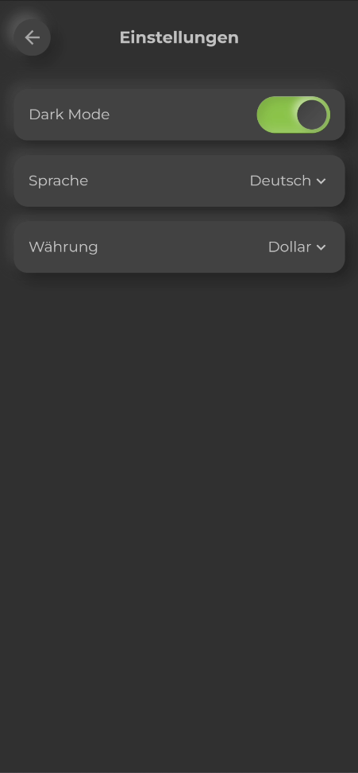

# My Finance Planer
 

 
My Finance Planer is a fantastic application that helps you manage your finances and provides money-saving tips. It offers an intuitive user interface and useful features to help you achieve your financial goals.

## Features

- **Financial Overview:** Display your account balances, income, and expenses in a clear and concise manner. 
 
- **Budget Management:** Define budgets for different categories and keep track of your spending.
- **Savings Tips:** Receive regular savings tips and advice to reduce your expenses. 
 
- **Custom Goals:** Set personalized financial goals and track your progress.
- **Monthly budget:** Set personalized monthly budget maximums and keep your spendings under control. 
   

## Installation

1. Download the latest version of the app from the [App Store](https://nicht-existent.com).
2. Install the app on your device.
3. Open the app and sign in with your credentials or create a new account.

## Usage

1. Upon opening the app, you will need to create one or more accounts.
2. Click on one account card to open the account details and add transactions.
3. Navigate through the various tabs to view your income, expense and budget check.
4. Tap the info button in the app bar to access the saving tips.,
5. Configure your user settings and language through the settings menu. 
 
6. Regularly update your expenses to stay on top of your financial situation.

## Contributors

- Serdar Özteke - [Gitty Profile](https://gitty.informatik.hs-mannheim.de/1925809)
- Arlind Isa - [Gitty Profile](https://gitty.informatik.hs-mannheim.de/1925670)

We welcome contributions from the community! If you have any suggestions for improvements or have found a bug, feel free to open a pull request or create an issue in our [Gitty repository](https://gitty.informatik.hs-mannheim.de/1925809/cpd_app_gruppe).

## License

This project is licensed under the HSMA License. For more information, please see the [LICENSE](LICENSE) file.

© 2023 My Finance Planner. All rights reserved.